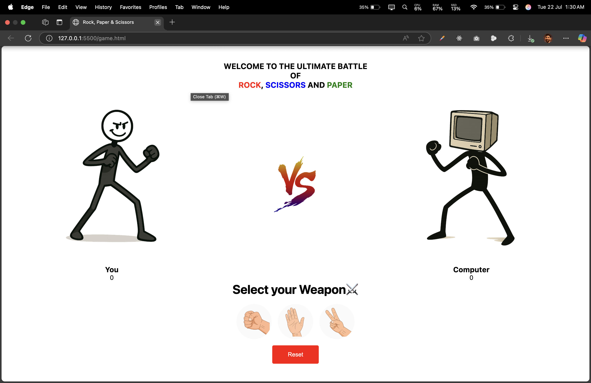

# 🪨📄✂️ Rock Paper Scissors Game

A fun and interactive Rock Paper Scissors game built with HTML, CSS, and JavaScript. Challenge the computer in this classic game with a modern, responsive design!

## Live Demo(https://rock-sci-paper-bg.netlify.app/)



##Figma File(https://www.figma.com/design/jDrCIn4XPGCkQV4zciIAUU/Rock-paper-scissors?node-id=0-1&t=d6XEDluTaPCvsnV3-1)

## 🎮 Features

- **Interactive Gameplay**: Click on rock, paper, or scissors to make your choice
- **Smart Computer AI**: Computer makes random choices for fair gameplay
- **Real-time Score Tracking**: Keep track of wins for both player and computer
- **Visual Feedback**: See both your choice and the computer's choice with emojis
- **Responsive Design**: Clean, modern interface that works on all devices
- **Hover Effects**: Interactive buttons with smooth animations
- **Game Reset**: Reset scores and start fresh anytime

## 🚀 How to Play

1. Click on one of the three weapon buttons: Rock 🪨, Paper 📄, or Scissors ✂️
2. The computer will automatically make its choice
3. Results are displayed instantly:
   - Rock beats Scissors
   - Scissors beats Paper
   - Paper beats Rock
4. Scores are updated after each round
5. Use the Reset button to start over

## 📁 Project Structure

```
rock-paper-scissors/
│
├── game.html              # Main HTML file
├── style.css              # Styling and animations
├── script.js              # Game logic and functionality
├── public/
│   └── images/
│       ├── rock.png       # Rock choice icon
│       ├── paper.png      # Paper choice icon
│       ├── scissors.png   # Scissors choice icon
│       ├── HUMAN.png      # Player character
│       ├── COMPUTER.png   # Computer character
│       └── verses.png     # VS logo
└── README.md              # Project documentation
```

## 🛠️ Installation & Setup

1. **Clone the repository**

   ```bash
   git clone https://github.com/PickMcFlurry/rock-paper-scissors.git
   cd rock-paper-scissors
   ```

2. **Open the game**

   - Simply open `index.html` in your web browser
   - Or use a local server for better performance:

   ```bash
   # Using Python
   python -m http.server 8000

   # Using Node.js
   npx serve .
   ```

3. **Start Playing!**
   - Navigate to `http://localhost:8000` (if using local server)
   - Or just double-click `index.html`

## 💻 Technologies Used

- **HTML5**: Structure and layout
- **CSS3**: Styling, animations, and responsive design
- **JavaScript (ES6+)**: Game logic and interactivity
- **Custom Graphics**: Hand-designed game icons and characters

## 🎨 Game Rules

| Player Choice | Computer Choice | Result        |
| ------------- | --------------- | ------------- |
| Rock 🪨       | Scissors ✂️     | Player Wins   |
| Rock 🪨       | Paper 📄        | Computer Wins |
| Paper 📄      | Rock 🪨         | Player Wins   |
| Paper 📄      | Scissors ✂️     | Computer Wins |
| Scissors ✂️   | Paper 📄        | Player Wins   |
| Scissors ✂️   | Rock 🪨         | Computer Wins |
| Same Choice   | Same Choice     | Tie           |

## 🔧 Customization

You can easily customize the game by:

- **Changing Colors**: Modify CSS variables in `style.css`
- **Adding Sound Effects**: Include audio files and update `script.js`
- **New Graphics**: Replace images in the `public/images/` folder
- **Game Modes**: Extend `script.js` to add best-of-X rounds or difficulty levels

## 🤝 Contributing

Contributions are welcome! Here's how you can help:

1. Fork the repository
2. Create a feature branch (`git checkout -b feature/amazing-feature`)
3. Commit your changes (`git commit -m 'Add amazing feature'`)
4. Push to the branch (`git push origin feature/amazing-feature`)
5. Open a Pull Request

### Ideas for Contributions:

- Add sound effects
- Implement difficulty levels
- Add multiplayer mode
- Create mobile app version
- Add game statistics/history

## 📱 Browser Compatibility

- ✅ Chrome (recommended)
- ✅ Firefox
- ✅ Safari
- ✅ Edge
- ✅ Mobile browsers

## 🙏 Acknowledgments

- Icons and graphics designed specifically for this project
- Inspired by the classic Rock Paper Scissors game
- Built with modern web technologies for optimal performance

---

⭐ **Star this repository if you enjoyed the game!** ⭐

Made with ❤️ by Bardan Gurung


